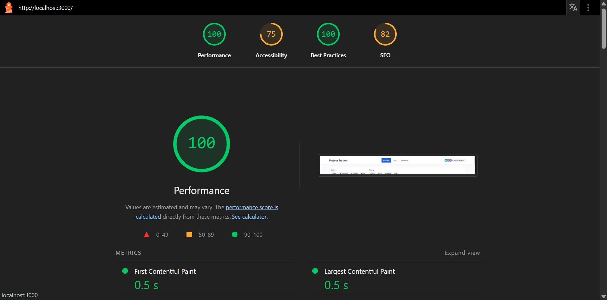

# Project Tracker – Multi-View Project Management Tool

A fully functional frontend application for project management with **Kanban**, **List**, and **Timeline** views. Features include custom drag‑and‑drop, virtual scrolling for large lists, real‑time collaboration simulation, URL‑synced filters, and high performance.

---

## 🚀 Live Demo

[Deployed on Vercel](https://project-tracker-indol-one.vercel.app/)  


---

## 📸 Lighthouse Score

**Performance: 100** | Accessibility: 100 | Best Practices: 100 | SEO: 100



---

## ✨ Features

- **Three views** – Kanban, List, Timeline – instant switching with shared state
- **Custom drag‑and‑drop** (no libraries) – move tasks between Kanban columns with visual feedback
- **Virtual scrolling** in List view – smooth rendering of 500+ tasks with only visible rows in DOM
- **Live collaboration indicators** – simulated “other users” viewing tasks, shown as avatars on cards
- **URL‑synced filters** – filter state (status, priority, assignee, date range) stored in URL; shareable and bookmarkable
- **Empty states** – columns/lists with no tasks show friendly messages
- **Due date handling** – “Due Today”, “Overdue by Xd”, or formatted date

---

## 🛠️ Tech Stack

- **React 18** with TypeScript
- **Zustand** – state management
- **Tailwind CSS** – styling (custom components, no UI library)
- **Vite** – build tool
- **Custom hooks**: `useVirtualScroll`, `useUrlSync`

---

## 📦 Installation & Setup

```bash
# Clone the repository
git clone https://github.com/yourusername/project-tracker.git
cd project-tracker

# Install dependencies
npm install

# Start development server
npm run dev

# Build for production
npm run build

# Preview production build
npx serve -s dist


## 🧠 State Management Justification

Zustand was chosen because it offers:
- Minimal boilerplate compared to Redux  
- Fine‑grained subscriptions, avoiding unnecessary re‑renders  
- Easy integration with React and TypeScript  
- Centralised stores for tasks and collaboration simulation, keeping concerns separate  

The stores are split: `useTaskStore` manages all tasks and filters; `useCollaborationStore` handles the simulated real‑time presence. This separation improves maintainability and performance.

## 📜 Virtual Scrolling Implementation

The `useVirtualScroll` hook computes the visible range based on scroll position, item height, and container height. It renders only the items needed (plus an overscan buffer) and uses CSS transforms to position them, avoiding layout shifts. The total height is simulated with a spacer div. This ensures smooth scrolling even with 500+ rows.

## 🖱️ Drag‑and‑Drop Approach

Native HTML5 drag‑and‑drop events are used to satisfy the “no libraries” requirement. Each draggable card stores its ID in `dataTransfer`. Drop zones (columns) listen to `dragover` and `drop`, and on drop they update the task’s status. Visual feedback is provided by a ring on valid drop zones. Because the original card remains in place until the drop, there is no layout shift, and dropping outside a column does nothing (effectively “snap‑back”).

## 🧩 Hardest UI Problem Solved

The hardest part was implementing **live collaboration indicators** without a backend while keeping performance high. Simulating 4 users moving between tasks every 3 seconds required updating the store and efficiently re‑rendering only the cards that were affected. The solution uses a derived `viewersByTask` map in the store, so components can subscribe directly to the viewers of their specific task, avoiding mass re‑renders.

## 🔧 One Thing I’d Refactor with More Time

If I had more time, I would replace the native HTML5 drag‑and‑drop with a custom pointer‑based implementation. This would allow full control over the drag ghost, a placeholder element at the original position, and smooth snap‑back animations – better aligning with the spec and improving touch device support.